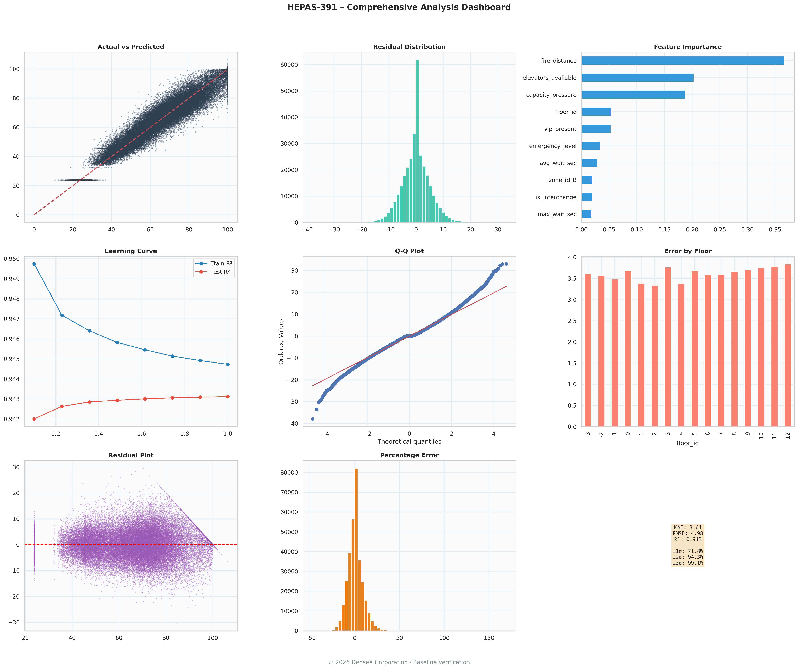
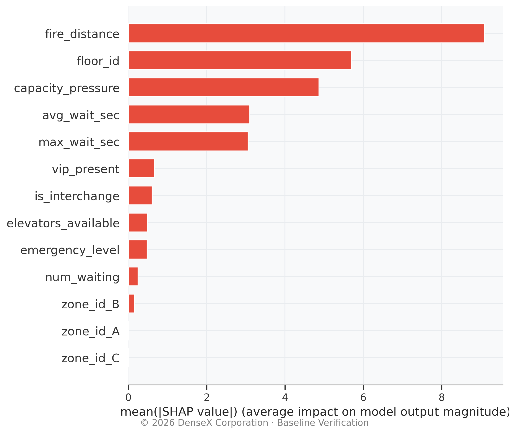
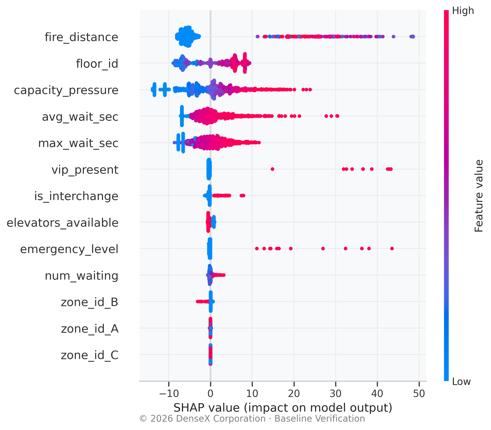

# 🏢 HEPAS-391: Hybrid Elevator Priority Allocation System  
**🔥 AI Emergency Dispatch Engine · 🚨 Fire Evacuation ML · 🛗 Smart Elevator Control**  

*Architected by DenseX Corporation*  

---

## ⚠️ THE THREAT – AI Hallucinations in Physical Space
Standard **elevator dispatching systems** collapse under **sensor noise**, **human panic**, and **multi‑zone complexity**.
**HEPAS-391** provides a **Deterministic Safety Reflex Layer**: a stochastic, physics‑bounded simulation
engine designed to test whether any **machine learning** algorithm can autonomously **prioritise human life**
over queue efficiency during **fire emergencies**, **medical events**, and **VIP transport**.

🔴 **Fire** · 🩺 **Medical** · 👑 **VIP** · 🚧 **Repair** · 🌐 **Multi‑Zone** · 🧠 **XGBoost AI**

---

## 🧮 THE DENSEX 391 PROTOCOL EQUATION
The deterministic ground-truth priority score (before stochastic corruption) is:

$$
P_f(t) = \min \left( 100, \underbrace{\alpha_1 W_f}_{\text{Queue}} + \underbrace{\alpha_2 \max(T_f)}_{\text{Max Wait}} + \underbrace{\Omega_{\text{emg}} E_f}_{\text{Emergency}} + \underbrace{\Omega_{\text{vip}} V_f}_{\text{VIP}} + \underbrace{\beta \frac{1}{D_{\text{fire}}(f)+\epsilon}}_{\text{Fire Proximity}} + \underbrace{\gamma \frac{1}{E_{\text{zone}}(f)+\epsilon}}_{\text{Elevator Scarcity}} + \underbrace{\delta \cdot I_f}_{\text{Interchange}} + \underbrace{\eta \cdot e^{\frac{\bar{T}_f-60}{30}}}_{\text{Wait Penalty}} \right)
$$

| Symbol | Value | Meaning |
|---|---|---|
| $\alpha_1$ | 2.0 | Queue weight |
| $\alpha_2$ | 0.05 | Max-wait weight |
| $\Omega_{\text{emg}}$ | 0 / 200 / 500 | Normal / Medical / Fire multiplier |
| $\Omega_{\text{vip}}$ | 80 | VIP multiplier |
| $\beta$ | 300 | Fire-proximity coefficient |
| $\gamma$ | 50 | Elevator-scarcity coefficient |
| $\delta$ | 15 | Interchange-floor bonus |
| $\eta$ | 1.0 | Exponential wait-penalty coefficient |
| $\epsilon$ | 0.1 | Division-by-zero guard |

---

## 📊 THE V2.0 STOCHASTIC DATASET
The 1 600 000‑row `hepas_dataset_v2_noisy.csv` is **deliberately contaminated** with **real‑world sensor imperfections**.
Every feature value and target label contains **injected Gaussian & behavioural noise** to force genuine generalisation.

### 📋 Dataset Specifications
| Property | Value |
|---|---|
| Total samples | 1 600 000 |
| Raw features | 11 |
| Encoded features | 13 (one‑hot `zone_id`) |
| Target | `target_priority_noisy` |
| Noise config | 15 % arrival, 20 % wait‑time jitter, 5 % sensor error, 25 % behavioural variance, 2 % outliers |
| Emergency incidence | ~2.88 % (medical or fire) |
| Building layout | 16 floors (B3→12), 3 zones, 6 elevators (1 under repair), 2 interchanges |

### 📖 Exhaustive Data Dictionary
| Feature | Type | Physical Interpretation |
|---|---|---|
| `floor_id` | Integer | Vertical position (−3…12). Spatial anchor for **elevator routing**. |
| `zone_id` | Categorical | Operational sector A/B/C (one‑hot encoded). Prevents **cross‑zone inefficiency**. |
| `num_waiting` | Float | **Corrupted** (5 % Gaussian error). Teaches model to distrust raw **camera/weight sensor** feeds. |
| `max_wait_sec` | Float | Longest individual wait. Critical to prevent **passenger starvation**. |
| `avg_wait_sec` | Float | Mean wait – encodes **thermal/crowd comfort**. |
| `vip_present` | Binary | High‑priority individual (executive, **emergency responder**). |
| `emergency_level` | Categorical | `0`=Normal, `1`=Medical, `2`=Fire. Absolute **routing override**. |
| `fire_distance` | Float | Distance to active **fire** (−1 if none). Inverse proximity triggers **evacuation overrides**. |
| `elevators_available` | Integer | Healthy elevators in the zone. Handles **breakdown/maintenance** scenarios. |
| `is_interchange` | Binary | Sky‑lobby **transfer floor** flag. Experiences sudden passenger surges. |
| `capacity_pressure` | Float | Ratio of waiting passengers to elevator capacity – **engineered load metric**. |
| `target_priority_deterministic` | Float | **Reference only** – clean physics label. |
| `target_priority_noisy` | Float | **Training label** – corrupted with all noise sources. |

---

## 📈 BASELINE TELEMETRY (Infrastructure Verification)
*Results from a simple, untuned **XGBoost** model, verifying the simulated environment.*

### 🧾 Comprehensive Analysis Dashboard
  
*Residual plots, learning curves, Q‑Q diagram, and error‑by‑floor analysis – proof that the **physics‑based simulation** is mathematically sound.*

### 🔍 SHAP Feature Importance
  
*Bar chart confirming that `fire_distance`, `max_wait_sec`, and `avg_wait_sec` dominate the prediction – **mathematical evidence of life‑safety prioritisation**.*

### 🐝 SHAP Summary Matrix
  
*Beeswarm plot showing individual feature impact. High‑value `emergency_level` and `fire_distance` (red) push predictions toward maximum priority – **deterministic safety override visualised**.*

---

## 🔬 🎓 OPEN CALL FOR APPLIED RESEARCH
The HEPAS-391 dataset is **raw, stochastic, and hostile** to simple models.
**We invite university researchers and ML engineers to fork this repository and build:**

🛠️ **Feature Engineering** – Superior spatial‑density metrics, temporal patterns, interaction terms.  
🧪 **Comparative Benchmarking** – Logistic regression, random forests, deep neural networks, reinforcement learning vs. baseline XGBoost.  
🔧 **Hyperparameter Optimisation** – Optuna, evolutionary tuning on high‑noise tabular data.  
📊 **Explainable AI** – SHAP, LIME, Integrated Gradients to prove **life‑safety prioritisation**.  
🖥️ **Deployment Interface** – Streamlit/React dashboard for **real‑time dispatch** & emergency injection.

> ℹ️ The included baseline XGBoost (R²≈0.94) was **deliberately left untuned and un‑optimised**.  
> Your contribution is the **applied ML pipeline** – feature engineering, comparative benchmarks, hyperparameter tuning, explainability, and production UI.  
> The simulation engine and dataset are the **infrastructure**; the **intelligence is your work**.

---

## ⚖️ LICENSING & ENTERPRISE INTEGRATION
🔓 **Academic / Open Source** – Free under **AGPL‑3.0**.  
🏢 **Commercial** – Integration into proprietary **building management systems**, **smart city infrastructure**, or **SaaS dispatch platforms** requires a separate license.  
📧 **Enterprise inquiries:** `densex.corp@gmail.com`

© 2026 DenseX Corporation. All rights reserved.
